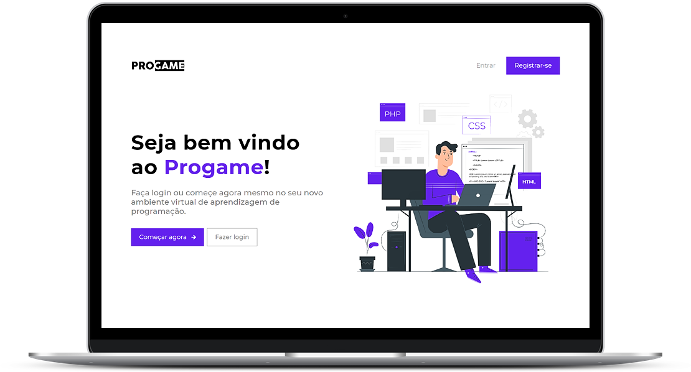

  

  Ambiente Virtual de Aprendizagem Gamificado para disciplinas de programação
   
  (Repositório de demonstração do projeto)

 

  

## :dart: Sobre o projeto

O ProGame é um AVA que tem como objetivo facilitar o processo de busca e produção de conteúdo educacional do professor, proporcionando também um feedback mais rápido e direcionado a identificar os problemas dos alunos, sob a perspectiva da Taxonomia Revisada de Bloom, uma teoria de aprendizagem que organiza de forma hierárquica os objetivos de aprendizagem.

A plataforma permite que os professores criem turmas e cadastrem conteúdos de estudo para que os alunos possam responder em forma de Quiz. A partir dos dados de uso destes alunos na plataforma, exibidos na área de estatísticas da turma, o professor pode fornecer feedback personalizado aos alunos.

Além do Quiz, a plataforma que é desenvolvida usando a técnica conhecida como 'Gamificação', também implementa outras mecânicas de games, tais como obtenção de Pontos, competição por meio de Rankings, debloqueio de Badges/Conquistas secretas, Níveis e Feedback imediato, que possibilitam o engajamento e motivação dos alunos na resolução das atividades.

## :hammer_and_wrench: Desenvolvimento

A plataforma foi desenvolvida utilizando as seguintes ferramentas e tecnologias:
- Python
- Framework Django
- HTML
- CSS
- Framework Bootstrap
- JavaScript
- React

## :trophy: Demonstração da plataforma

Abaixo uma pequena demonstração de uso da plataforma por um usuário do tipo Aluno:

  

## :speech_balloon: Mais informações

- Este é um repositório de demonstração do projeto. O repositório principal é privado.
- Para saber mais sobre o projeto, entre em contato com os desenvolvedores.
